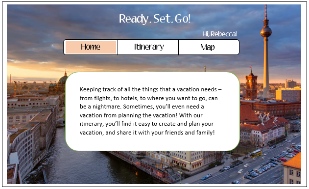
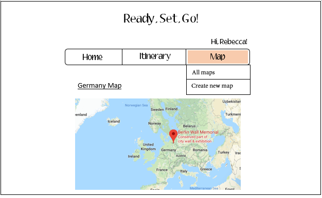
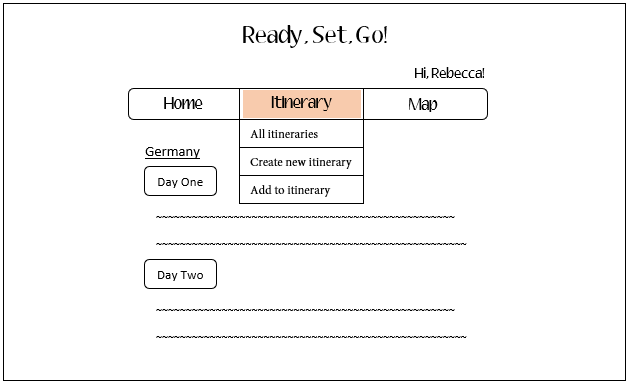
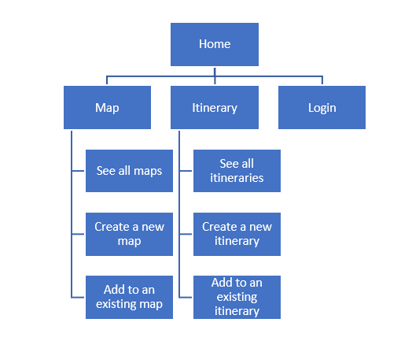

# Ready, Set, Go!

## Overview
Sometimes, planning your vacation is hard. This web app will help people plan and share their vacations with their friends and family. Users can register and login. Once they are logged in, they can create and add to an itinerary of where they want to go, pin it on a map, and share with friends or family who are also users of the web app.

## Data Model
The application will store Users, their corresponding itineraries, and their map.

An example User:
```javascript
{
    username: "rebecca112233",
    email: //an email,
    password: //a password,
}
```

An example itinerary list:
```javascript
{
    userID: //reference to user object
    name: "Trip to Germany",
    location: "Germany",
    days: 10,
    description: "Had lots of fun"
}
```

An example map:
```javascript
{
    markerPositions: //where the user has marked
    markerDescriptions: //description of what the user has marked
    userID: //reference to user object
}
```
## [Link to Commented First Draft Schema](db.js)

## Wireframes
/ - home page that describes what the web app is, where you can navigate to different sections


/map - shows the favorited map, gives you the option of creating an new map, looking at all the maps, or adding a new pin to the current map


/itinerary - shows the favorited itinerary, gives you the option of creating a new itinerary, looking at all the itineraries, or adding to a current itinerary


## Site map


## User Stories or Use Cases
1. as a non-registered user, I can register a new account
2. as a user, I can log in to the site
3. as a user, I can create a map of locations that I plan on going to
4. as a user, I can create an itinerary
5. as a user, I can share these elements with other users 

## Research Topics
- (2 points) Foundation
    - Use Foundation as my CSS framework 
    - I only know Bootstrap, so I think it would be valuable to gain more experience using different CSS frameworks
- (3 points) Form validation
    - Perform client side form validation using custom JavaScript
    - show the user error messages when they try to submit incorrect fields
- (1 point) jQuery
    - Use jQuery, the JavaScript library to simplify some client-side JavaScript code
- (2 points) Leaflet
    - use Leaflet as a library in Javascript for my maps

## [Link to Initial Main Project File](app.js)

## Annotations/References Used
1. [using leaflet](https://leafletjs.com/examples/quick-start/)
2. [using foundation](https://foundation.zurb.com/sites/docs/)